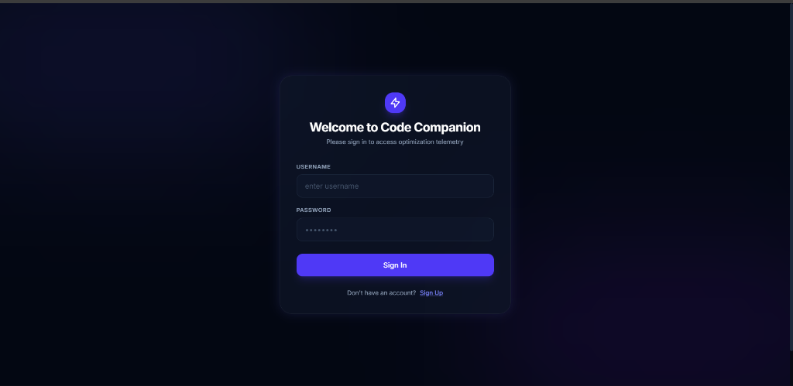
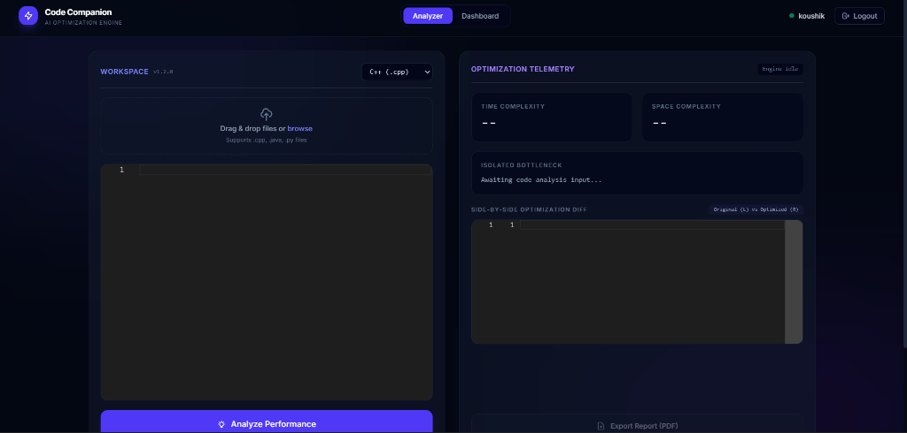
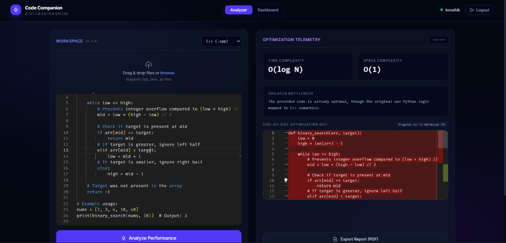
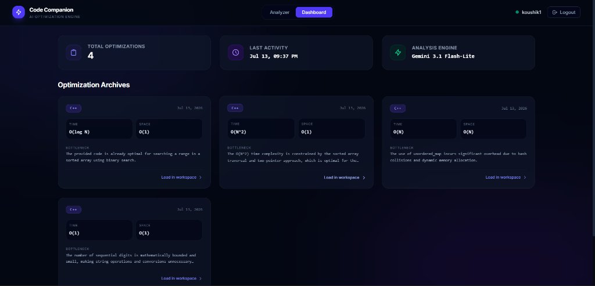

# 📸 Code Companion - Screenshots & Visual Overview

This document presents visual walkthrough screenshots of the **Code Companion** application.

---

## 1. 🔐 User Authentication Screen
Gated access ensuring users sign in or sign up before viewing their private optimization telemetry and history.

---

## 2. 💻 Analyzer Workspace (Idle State)
Interactive workspace featuring Monaco Editor, multi-language selector (C++, Java, Python), drag-and-drop file upload zone, and empty optimization telemetry panel.

---

## 3. ⚡ AI-Generated Code Analysis & Side-by-Side Optimization Diff
Real-time analysis results from Google Gemini API showing estimated Time Complexity (\(O(\log N)\)), Space Complexity (\(O(1)\)), isolated bottleneck breakdown, and side-by-side Monaco diff highlighting optimized syntax and refactoring.

---

## 4. 📊 Optimization Dashboard
Persistent history dashboard showcasing total optimizations performed, timestamp of last activity, active Gemini AI model engine, and archived code analyses available for instant workspace reloading.

